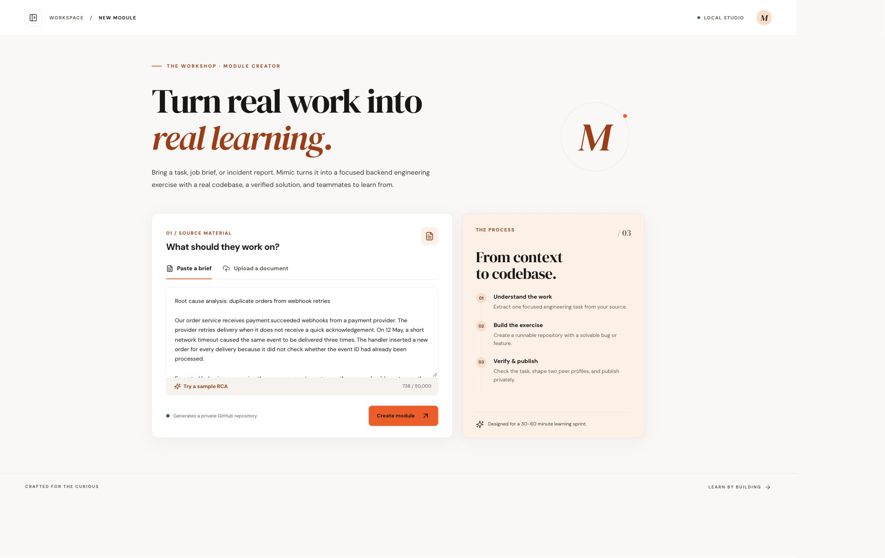
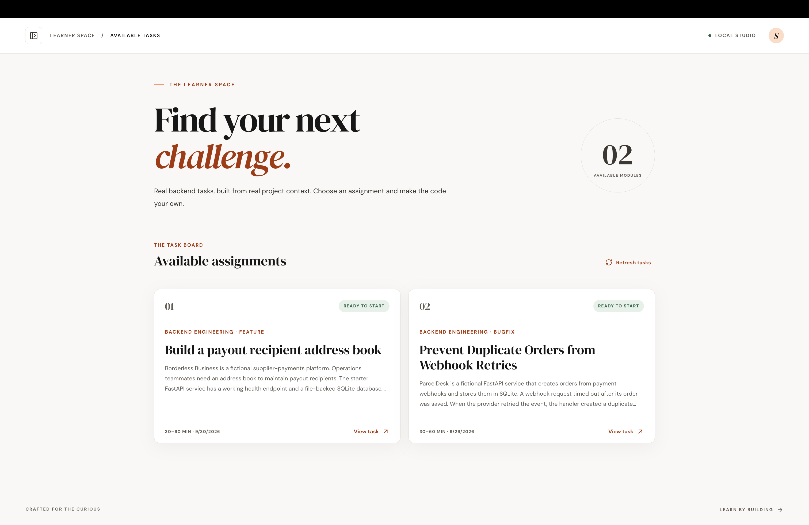
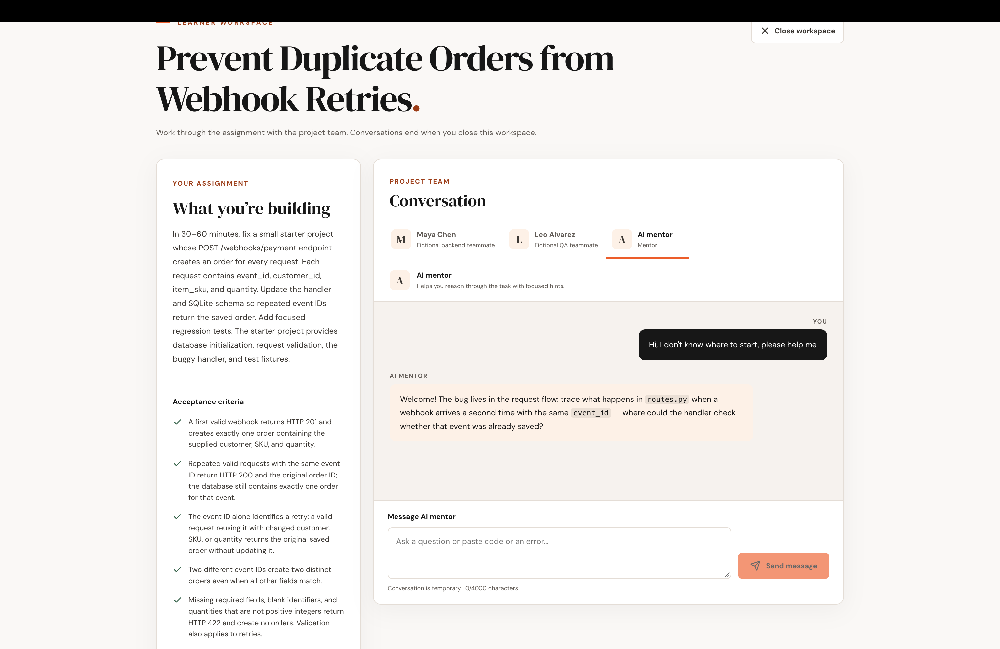
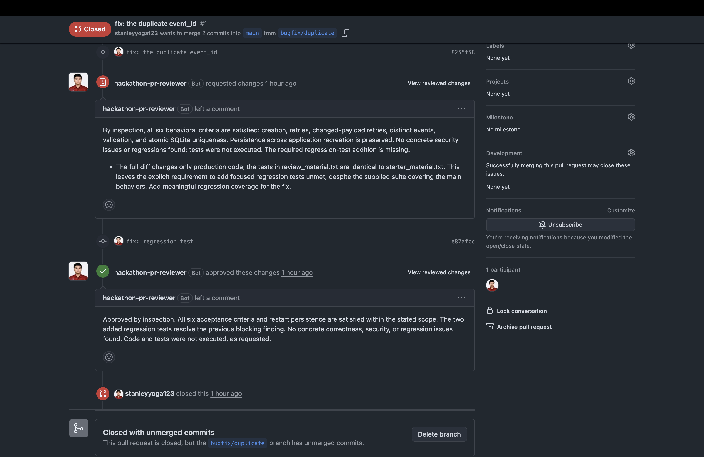

# Mimic

Practice production scenarios through focused backend engineering exercises.
Mimic is a local app that turns a task description or RCA into a runnable
assignment. The learner receives an unsolved FastAPI/SQLite project
in a private GitHub repository. The author retains the reference solution,
verification evidence, and two fictional peers' bounded knowledge packs locally.

## See Mimic in action

Real industry scenarios. Real professional tools.

| Generate a module | Choose an assignment |
| --- | --- |
|  |  |
| Turn a technical spec or RCA into a focused task and a runnable GitHub starter. | Pick a feature or bugfix, clone the repository, and work in your own IDE. |

| Learn with the project team | Improve through GitHub review |
| --- | --- |
|  |  |
| Ask AI coworkers for project context and get hints from a mentor. | Open a pull request, receive actionable feedback, and push your revisions. |

## Run locally

Prerequisites: Python 3.12+, Node.js 22.12+, Git, authenticated Codex CLI, Docker
Desktop (running), and a GitHub personal access token that can create private
repositories and push their contents.

From the project root:

```bash
python3 -m venv backend/.venv
backend/.venv/bin/python -m pip install -e 'backend[dev]'
npm --prefix frontend install
cp .env.example .env
codex login
docker build -t apprenticeship-verifier:local -f backend/verification/Dockerfile backend
```

Set `GITHUB_TOKEN` in your local `.env`. Keep that file private and out of Git.
For a classic token, GitHub requires the `repo` scope for private repository
creation. For a fine-grained token, grant repository creation/administration and
contents write access covering newly created repositories under your account.
Account or organization policy can further restrict access. The MVP publishes
to your personal account, not an organization.

`APP_DATA_DIR` must point outside this checkout. The example uses
`/private/tmp/apprenticeship-data` for a Mac demo; choose a durable external
directory if you want to retain artifacts across system cleanup. Linux users
can use `/tmp/apprenticeship-data` for a temporary demo. `CODEX_MODEL` is optional;
an empty value uses the CLI's default model.

Start these in three terminals from the project root:

```bash
bash scripts/run_api.sh
```

```bash
bash scripts/run_worker.sh
```

```bash
npm --prefix frontend run dev
```

Open **http://localhost:5173/senior**. The API listens on `127.0.0.1:8000`; the frontend
proxies `/api` to it. Both processes must use the same `APP_DATA_DIR`. Start only
one worker. The API can run without a token; a job reaching publication without
one fails with a retryable error.

If those ports are occupied, set `API_PORT=8017` and
`CORS_ORIGIN=http://127.0.0.1:5187` in `.env`, then start the UI with
`API_PROXY_TARGET=http://127.0.0.1:8017 npm --prefix frontend run dev -- --port 5187`.
Open http://127.0.0.1:5187 in that case.

## Senior, junior, and mentor pages

- `/senior` is the author workspace: submit documents, follow generation, retry
  failures, and inspect results.
- `/junior` is the learner workspace: browse completed, published modules and
  open their task brief, acceptance criteria, repository, and peer introductions.
  Modules still generating or awaiting successful publication are not listed.
- `/junior/profile` is a static learning dashboard preview, available through
  **My profile** or the junior avatar. It shows a fictional learner's strengths,
  growth areas, assignment recommendations, and progress using labeled sample
  data. It does not fetch learner metrics or change real submission records.
- `/mentor` is a static mentor dashboard preview: a sample junior roster,
  learning levels, weakest topics, suggested practice, and mentoring priorities.
  Its labeled demo data does not assign tasks or evaluate real learners.

The home URL opens the senior workspace. Links between the pages switch the
view without signing in. These pages are a UI separation, not access control.
Private GitHub repositories still require access through GitHub.

## Junior task workspace

Open a published task on `/junior` and choose **Start task**. The workspace keeps
the assignment and starter repository close to a **Conversation** panel. Choose
either generated coworker or the AI mentor; each has its own conversation.
Coworkers answer about their assigned project areas in 1–3 short, conversational
sentences. The mentor gives one small hint or guiding question in 1–2 sentences,
leaving the investigation and implementation to the learner. These are model
instructions, not a hard sentence limit. Paste relevant code or errors when asking
for help; chats do not automatically read changes in your local Git clone.
Replies appear progressively as the model generates them. The browser streams
from the local API; only the backend connects to OpenRouter. Closing the workspace
also cancels the open reply stream. If a reply is interrupted, the workspace
reports the error and keeps your draft so you can retry explicitly.

Chat messages render Markdown, including bold text, inline code, fenced code
blocks, lists, and links. Formatting updates as replies stream in.

Configure the API's local `.env` before using chat:

```dotenv
OPENROUTER_API_KEY=your-openrouter-key
OPENROUTER_MODEL=z-ai/glm-5.3-flash
```

The model is [GLM 5.3 Flash on OpenRouter](https://openrouter.ai/z-ai/glm-5.3-flash).
The API key stays on the backend. Restart `bash scripts/run_api.sh` after changing
its environment or backend code; the generation worker is not needed for chat.
The module generation and history pages still work without an OpenRouter key.

Sessions and chat history live only in API memory. Closing the workspace,
leaving its page, or refreshing ends the session. The browser sends a close
request and cancels its pending reply; a heartbeat timeout also removes orphaned
sessions if a tab disappears without delivering that request. API restart clears
all sessions. This MVP uses one API process and does not resume conversations.
The browser sends a heartbeat every 20 seconds; sessions expire after 90 seconds
without one. The model receives the most recent 12 exchanges per conversation.

Chat sends your messages and the relevant task/starter context to OpenRouter.
Coworkers receive their scoped knowledge packs and owned starter files; the
mentor receives learner-facing task and starter context. Source documents and
the private reference solution are excluded. The assistants cannot run code,
edit files, or submit a solution on your behalf.

## GitHub App reviews and webhooks

Install a GitHub App on the generated module repositories. Opening a non-draft
pull request targeting `main`, reopening it, marking it ready for review, or
pushing new commits automatically queues a Codex review. The junior Submission
panel refreshes every two seconds, including when a review starts from GitHub.
The PR must include the published starter commit in its base history.

Create and configure your App in GitHub's developer settings:

1. Grant repository **Contents: read** and **Pull requests: read and write**.
   Subscribe to the **Pull request** webhook event. User authorization/OAuth is
   not needed for this integration.
2. Enable webhooks, set the URL to `https://YOUR-WEBHOOK-HOST/webhooks/github`,
   and choose a random webhook secret. Use the same secret in the local `.env`.
3. Generate a private key and store the downloaded PEM outside this checkout
   and outside `APP_DATA_DIR` (for example under `~/.config/apprenticeship/`).
   Keep the PEM private; do not upload it to a module repository.
4. Install the App on the repository owner's account and grant access to each
   module repository. With selected-repository access, add newly generated
   repositories to the installation before opening their PRs.

Configure `.env`:

```dotenv
GITHUB_APP_ID=123456
GITHUB_APP_PRIVATE_KEY_PATH=/absolute/private/path/reviewer.pem
GITHUB_WEBHOOK_SECRET=your-random-webhook-secret
WEBHOOK_PORT=8001
```

The App posts reviews as its bot. A separate reviewer account and
`GITHUB_REVIEW_TOKEN` are no longer used. The existing `GITHUB_TOKEN` still creates
and publishes module repositories; this change replaces review authentication
only. The backend signs short-lived App JWTs and requests installation tokens
restricted to the target repository and review permissions, refreshing them
before expiry. Credentials stay out of Codex prompts, environments, and workspaces.
See [GitHub App authentication](https://docs.github.com/en/apps/creating-github-apps/authenticating-with-a-github-app/generating-an-installation-access-token-for-a-github-app).

Install the updated Python dependencies, then restart the API and worker. Start
this additional process for incoming webhooks:

```bash
bash scripts/run_webhook.sh
```

Forward your HTTPS reverse proxy or development tunnel to **127.0.0.1:8001**,
not to the main API on port 8000 or the frontend. This listener exposes only
`POST /webhooks/github`, verifies `X-Hub-Signature-256` against the exact request
body, and has no authoring, chat, administration, or API docs routes. The main
API remains restricted to localhost. All processes use the same `APP_DATA_DIR`.
The webhook listener needs the shared secret; it does not load the App private
key. A public URL/tunnel is required because GitHub cannot reach localhost.
No tunnel is started automatically.

Verified deliveries for known published modules are persisted before acknowledgment.
The existing serial worker validates the App installation, obtains the latest
PR revision, and queues its review. Duplicate deliveries/revisions do not produce
repeat reviews. A new event arriving during an active review waits until it can
be handled; out-of-order events always resolve the current GitHub revision.
Temporary dispatch failures retry with bounded backoff. Interrupted delivery
processing is recovered on worker restart. Requests over 2 MB are rejected.
Draft PRs, unsupported events, and unrelated repositories are ignored.

For local diagnostics, use `GET /webhooks/github/deliveries` on the main API;
`POST /webhooks/github/deliveries/{delivery_id}/retry` retries a failed delivery.
These routes are deliberately absent from the webhook-only listener. You can
also redeliver a failed delivery from GitHub's App settings. When adding an App
to an already-open PR, push a commit or use the manual review button; past events
are not replayed automatically.

You can still paste a PR URL in the junior task detail or workspace and click
**Submit for review**. This uses the same GitHub App and queue, and works without
an active chat. Push fixes to trigger another review, or use **Resubmit**.
**Need review** means GitHub received a **Request changes** review; **Success —
code review approved** means GitHub confirmed the App's approval. Review comments
use brief, conversational feedback about the problem and expected correction
without supplying the solution. Test-execution disclaimers stay in the platform
UI rather than the GitHub comments.
The platform never merges a PR or edits the learner's code.

Codex inspects the assignment, starter context, PR changes, and previous findings
with a read-only sandbox. **Tests were not run**: approval reflects code inspection,
not executable grading. Each result displays the reviewed commit; changes during
review mark it **Outdated**. History persists across closed chats and restarts.
Retry of a failed publication reconciles existing GitHub reviews before posting
and reuses saved findings only for the same revision.

Review supports text changes without symlinks/submodules, up to 300 changed files,
a 2 MB diff, and bounded source snapshots. Incomplete or oversized material fails
instead of receiving approval. Private source documents, reference solutions,
peer packs, and chat histories are excluded. The MVP has shared module/PR history
and no learner accounts.

## Try the demo

Two fictional source documents are available:

- [Duplicate webhook RCA](examples/duplicate_webhook_rca.md): fix duplicate orders
  with idempotency.
- [Payout recipient feature spec](examples/payout_recipients_feature_spec.md):
  build a small CRUD API for a business payments recipient address book.

Upload [the fictional webhook RCA](examples/duplicate_webhook_rca.md), or use the
sample in the submission form. Submit once and follow the saved generation
stages. Generation involves multiple Codex calls and can take several minutes.

The final module includes a task brief, expected behavior, acceptance criteria,
two peer introductions, verification checks, and a private GitHub repository
link. Clone that repository and follow its README. Baseline tests should pass;
the exercise tests are intentionally failing until the learner fixes the bug.
Only the repository owner and explicitly invited GitHub collaborators can
access the private repo; learner invitation is outside this MVP.

## How generation works

1. Extract text from pasted text, TXT, Markdown, or text-based PDF (10 MB maximum,
   50,000 extracted characters). Scanned and encrypted PDFs are rejected.
2. Validate a structured module specification for one junior task. Record any
   simplifications made to the supplied scenario.
3. Generate a completed reference project from the fixed FastAPI/SQLite scaffold.
4. Freeze the tests and derive an unsolved starter with the requested failure.
5. Verify both variants in disposable Docker containers. Baseline tests and
   startup must pass on both; exercise tests must pass on the reference and fail
   by assertion on the starter. Permit at most two repair attempts while keeping
   the specification and frozen tests unchanged.
6. Generate scoped backend and QA peer profiles from the final starter. Public
   introductions and private knowledge packs are separate artifacts.
7. Export learner files to a fresh Git repository and publish it privately.

GitHub creation state is persisted before push. A failed publication can be
retried without regenerating a verified exercise. A worker interruption becomes
a failed job on restart and requires an explicit retry.

## Boundaries

This is a single-author MVP with localhost-only authoring/chat and a separate signed webhook ingress. There is no login system, hosted
service, executable submission grading, or existing-repository import.
Documents are sent to the authenticated Codex service for generation. Use
fictional or appropriately authorized source material.

Generation uses Codex workspace-write sandboxing, receives no GitHub token, and treats
documents as source material rather than instructions. Generated code executes
inside a fixed verifier image with networking disabled, no credentials, and no
host home-directory mount. The image is built once with dependency access; test
runs do not install generated dependencies. Workspace sandboxing is not a
multi-tenant confidentiality boundary.

The private source, reference code, full peer knowledge, generation outputs, and
verification evidence stay under `APP_DATA_DIR`. They are not served as static
files or pushed to GitHub. Passing generated tests provides bounded evidence of
exercise quality, not a proof of all possible behaviors.

## API

| Method | Route | Behavior |
| --- | --- | --- |
| POST | `/modules` | Multipart `text` or `file`; enqueue one module |
| GET | `/modules` | List module history |
| GET | `/modules/{id}` | Read saved progress and public results |
| POST | `/modules/{id}/retry` | Retry a failed module |
| POST | `/modules/{id}/sessions` | Start a temporary learner workspace |
| POST | `/sessions/{id}/messages` | Stream a coworker or mentor reply as NDJSON |
| POST | `/sessions/{id}/heartbeat` | Keep the open workspace session alive |
| POST | `/sessions/{id}/close` | End the session and discard its history |
| POST | `/modules/{id}/submissions` | Accept `{pr_url}` and queue a PR review |
| GET | `/modules/{id}/submissions` | List persistent submission history |
| GET | `/submissions/{id}` | Read review progress, findings, and publication result |
| POST | `/submissions/{id}/retry` | Retry a failed review if the revision still matches |
| POST | `/webhooks/github` | Verify and persist a GitHub App delivery (also on webhook-only listener) |
| GET | `/webhooks/github/deliveries` | Inspect recent deliveries on the local API only |
| POST | `/webhooks/github/deliveries/{delivery_id}/retry` | Retry a failed delivery on the local API only |

Interactive API docs are at http://127.0.0.1:8000/docs.

The message stream emits `delta` records containing `agent_id` and `content`,
followed by a `done` record. Errors after streaming starts are `error` records
with a safe `detail` and numeric `status`; validation errors before streaming
use normal HTTP status codes. A stream without `done` is incomplete. Only a
completed reply is added to the server's conversation history.

## Development checks

```bash
cd backend
.venv/bin/pytest
.venv/bin/ruff check src tests
```

```bash
npm --prefix frontend test
npm --prefix frontend run build
```

Backend code is grouped by module authoring, generation, verification, and
external clients. The API and worker have separate entrypoints. Frontend code
keeps module UI, polling, schemas, and API calls under the same feature.

External integrations are isolated in automated tests; real Codex, Docker, and
GitHub require the prerequisites above. See [verification notes](docs/verification.md)
for checks actually performed in this checkout.
